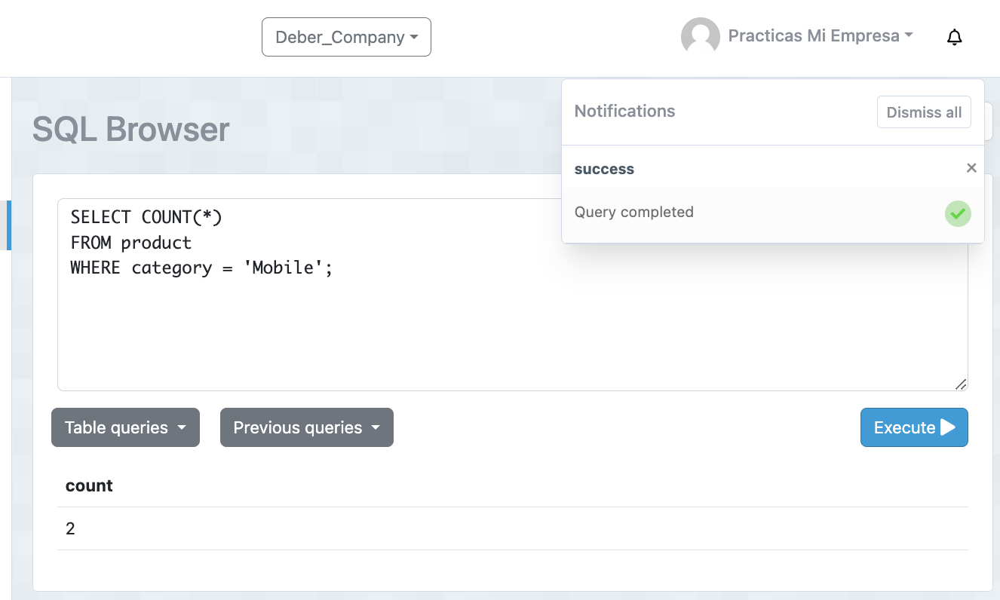
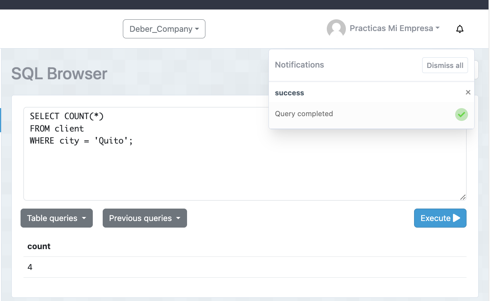
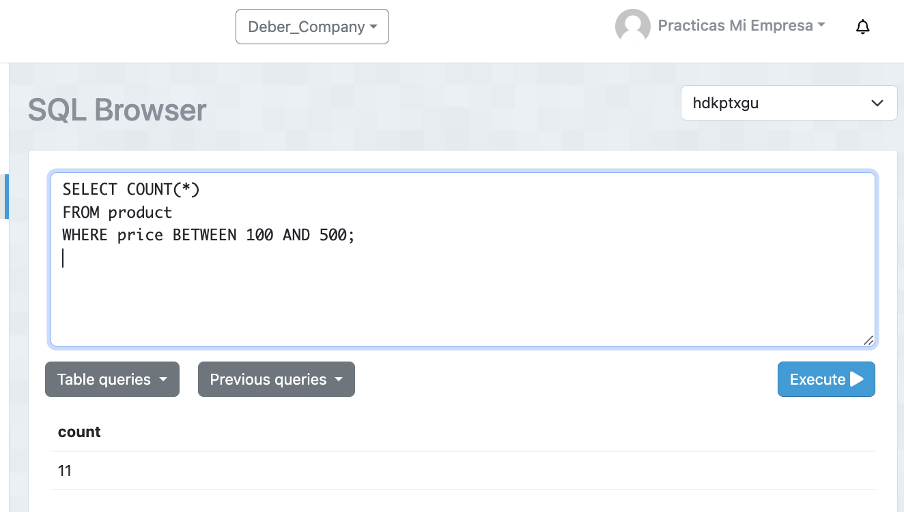
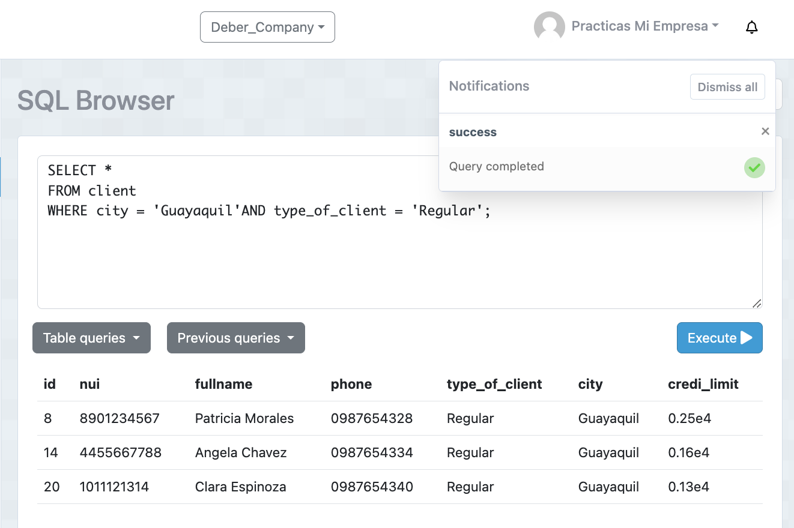
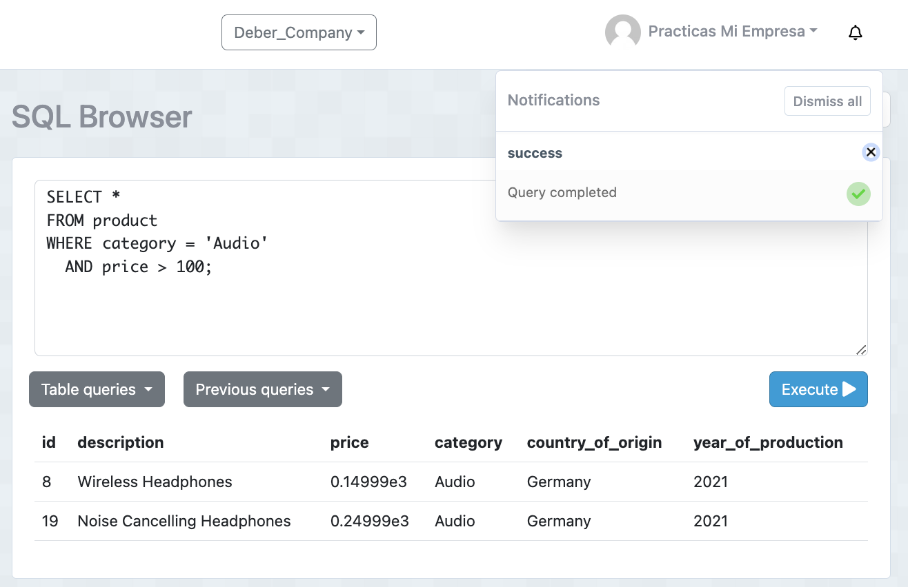
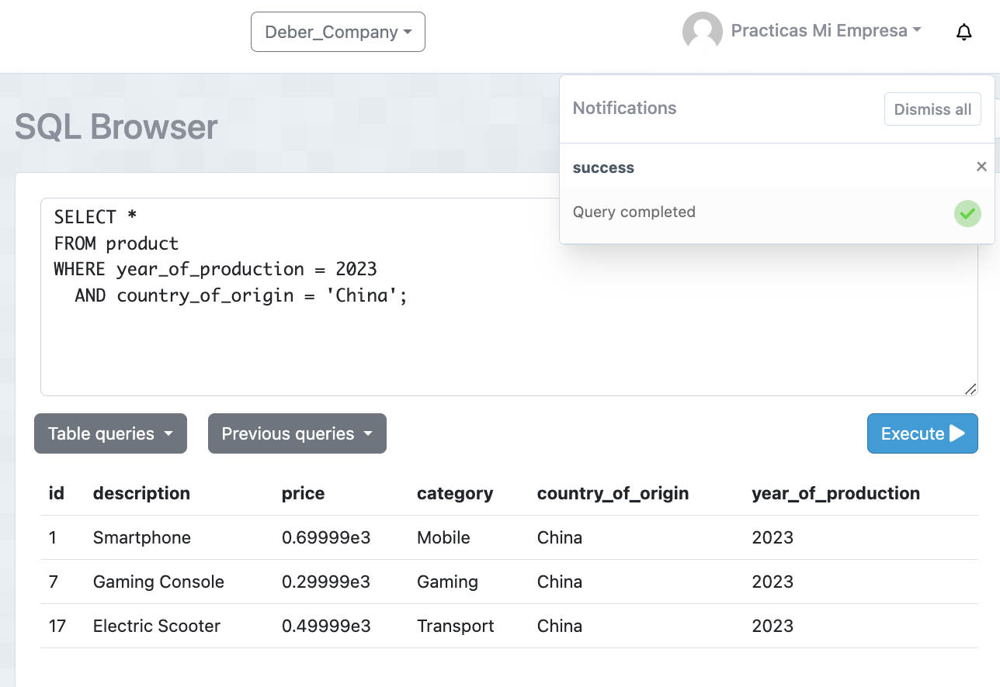
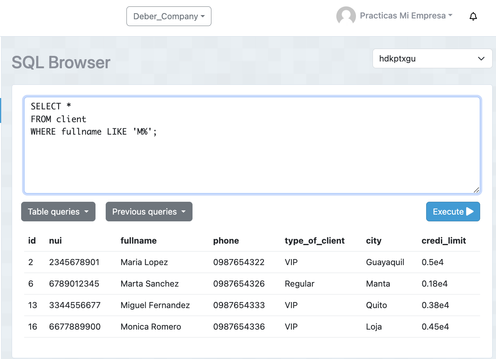
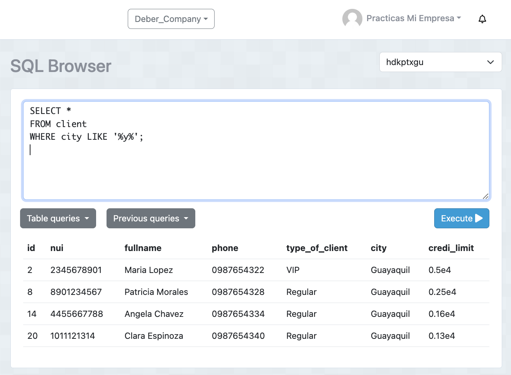

# Tarea TAS7 - Events
## 1. Contar el número de productos de una categoría específica.
  - Sentencia:
  ```
  SELECT COUNT(*) 
FROM product 
WHERE category = 'Mobile';
  ```
  - Captura:



## 2. Contar el número de clientes en una ciudad específica.
  - Sentencia:
  ```
  SELECT COUNT(*) 
FROM client 
WHERE city = 'Quito';
  ```
  - Captura:



## 3. Contar el número de productos cuyo precio está dentro de un rango específico 
  - Sentencia:
  ```
  SELECT COUNT(*) 
FROM product 
WHERE price BETWEEN 100 AND 500;
  ```
  - Captura:



## 4. Seleccionar clientes que viven en una ciudad específica y tienen un tipo de cliente específico
  - Sentencia:
  ```
  SELECT * 
FROM client 
WHERE city = 'Guayaquil' AND type_of_client = 'VIP';
  ```
  - Captura:



## 5. Seleccionar productos que pertenecen a una categoría específica y cuyo precio está por encima de un valor específico
  - Sentencia:
  ```
  SELECT * 
FROM product 
WHERE category = 'Audio' AND price > 100;
  ```
  - Captura:



## 6. Seleccionar productos que fueron producidos en un año específico y en un país de origen específico
  - Sentencia:
  ```
  SELECT * 
FROM product 
WHERE year_of_production = 2023 AND country_of_origin = 'China';
  ```
  - Captura:



## 7. Seleccionar clientes cuyo nombre completo comience con 'J'.
  - Sentencia:
  ```
  SSELECT * 
FROM client 
WHERE fullname LIKE 'M%';
  ```
  - Captura:



## 8. Seleccionar clientes cuya ciudad contenga la letra 'y'
  - Sentencia:
  ```
  SELECT * 
FROM client 
WHERE city LIKE '%y%';
  ```
  - Captura:



